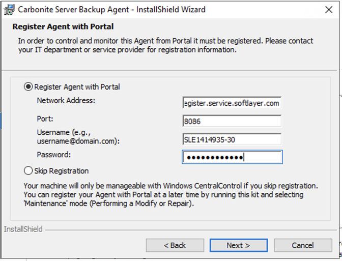

---

copyright:
  years: 1994, 2025
lastupdated: "2025-12-15"

keywords: IBM Cloud backup, EVault, Carbonite, backup, install agent, Windows, create BMR backup, create SQL backup

subcollection: Backup

---
{{site.data.keyword.attribute-definition-list}}

# Installing the backup client in Windows
{: #InstallinWindows}

You can install the {{site.data.keyword.backup_full}} client through a series of interactions on the server that is designated for the {{site.data.keyword.backup_notm}} service.
{: shortdesc}

## Logging in to the target device server
{: #logintargetWin}

1. Log in to the [{{site.data.keyword.cloud_notm}} console](/login){: external}. From the menu , select **Infrastructure**   > **Classic Infrastructure**.
2. Select **Devices** > **Device List** from the main menu to see the list of available servers.
3. Find the device for which you purchased the {{site.data.keyword.backup_notm}} service, and make note of its public IP address.
4. Click **Passwords** to display the Password manager, and see the usernames and the passwords that are associated with the account. The {{site.data.keyword.backup_notm}} service is listed as "Base Client".
5. Log in to the target device by using Remote Desktop Connection.

## Downloading the backup client
{: #downloadclient}

1. On the target server, open a browser session and enter the following URL to download the executable file for the {{site.data.keyword.backup_notm}} client.

   ```sh
   http://downloads.service.softlayer.com/evault/
   ```
   {: pre}

   The version number is in the file name. Choose the most recent.
   {{site.data.keyword.cloud}} offers separate 32-bit and 64-bit installers. If you have a 64-bit Operating System, download the file with x64 in its name. (For example, Agent-Windows-x64-8-32-7901.exe.)
   {: tip}

1. Double-click the downloaded file.

## Installing and Registering the Backup Agent
{: #registeragent}

1. Select the target language, and click **OK**.
1. Review the required Windows packages. Click **Install**. 
1. Click **Next** on the next couple screens until you reach the license agreement.
1. Read the General Enterprise Terms of Service.
1. Select "I accept the terms..." and click **Next**.
1. Select the setup type. Click **Next**.
1. If you selected the custom setup, choose the plug-ins that you want to install.
1. Specify the account to be used to run the agent services.
1. On the **Register Agent with Portal** screen, enter the following Network address, and add the username and password.

   ```sh
   cloudbackupregister.service.softlayer.com
   ```
   {: pre}

   {: caption="Register Agent with Portal." caption-side="bottom"}

   For more information about viewing the username or changing the backup password, see [Managing the username and password for the Cloud Backup service](/docs/Backup?topic=Backup-changePassword).
   {: tip}

1. Click **Next**.
1. Click **Install** to complete the installation.
1. When the installation is complete, restart your server.

Your servers must communicate with the Cloud Backup Portal and all AMP proxy servers for Cloud Backup Portal to work correctly, regardless of the data center's location. TCP Port 8086, 8087 must have access to `10.0.0.0/8`. For more information about port settings, see [Configuring Ports to allow communication between the backup agent and Cloud Backup Portal](/docs/Backup?topic=Backup-portinfo).

## Configuring backup agents
{: #configureagent}

Log in to Cloud Backup Portal to configure and manage your backup agents. For more information, see the [Getting started tutorial](/docs/Backup?topic=Backup-getting-started#getting-started).
